# DATA ENGINEERING MODULE

No starter module is where we go to the heart of the solution: data. Here we will perform the data operation, save to the database finish the ETL flow.

The solution was developed using 3 tools:
    - AWS S3;
    - Python;
    - Air flow;
    
The data were inserted into an S3 bucket, making it possible to carry out a transformation and load within a relational database.

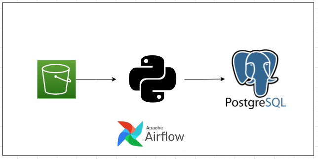

Therefore, we will start the step of operating the data inside an S3 bucket.

## Infraestrutura

To be included again in the production environment, we created a docker container for airflow and for our relational postgres database.

Inside docker-compose.yaml it is possible to create containers for both.

For airflow, when did locally, we use the following information:

- URL: http://localhost:8080
- Default Login: airflow / airflow

- URL: http://localhost:8080
- Default login: airflow / airflow

To access the database we use:

- Host: operational-db
- Port: 5432
- Default login: admin / admin
- Database name: company data

From this information, we created two docker containers. We can see its execution in the image below:

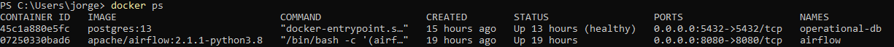

## Define Roles para Users

As a form of data governance, Roles were created for each type of role. This will only allow access to the data that will be controlled for your role. inside the file
    - db_admin/setup_users.sql
It was defined as the following roles:
    - ds_user_role
    - mle_user_role

We can see in the image below the functions inside the database:

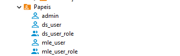

## Extract data from S3

The daredata-technical-challenge-data bucket was made available within S3 containing the following files:

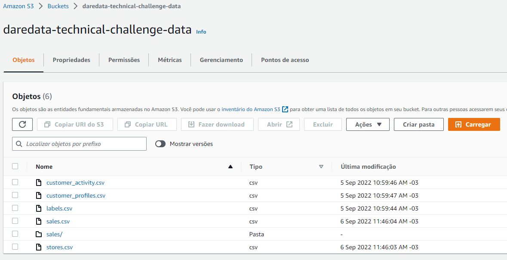

to carry out the
The solution contains 3 dags, which are:
    - load_client_data: contains a data load related to a customer. This dag does a load of 4 tables.
    - load_sales_data: load of data related to sales, from 2020 to 2029.
    - process_data: create tables from previous loads.

Airflow itself has a very accessible graphical interface so that it has an interface. We can see it below:

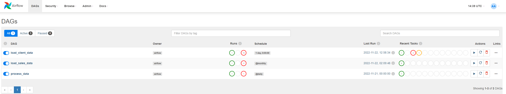

As we use two containers within the services of the containers, it was necessary to create the connection between them and allow a greater variety of accesses. For this, we perform the following configuration:

{
    "operational_db": {
        "conn_type": "postgres",
        "login": "admin",
        "password": "admin",
        "host": "operating db",
        "port": 5432,
        "scheme": "company data"
  }
 }

Such configuration can also be done via the airflow UI, in the ADMIN -> Connections section.

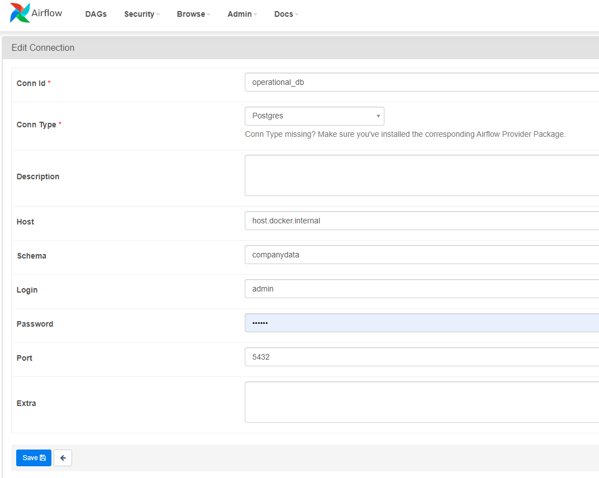

So that we could use our Postgres database, we used the DBeaver tool. There put all the credentials and have a GUI as well.

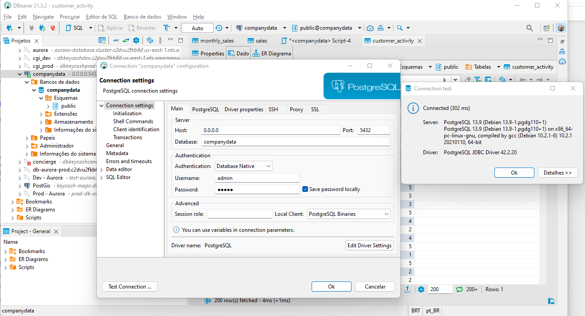

With the connection properly created, database and tables created, we carry out the execution of the series.

To get the customer data, we run the load_client_data dag. We can write inside the flow below and dag see successful ways implemented within the database.

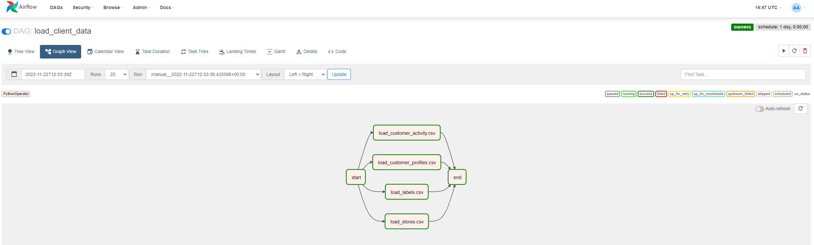

In the same way we run like two other dags.

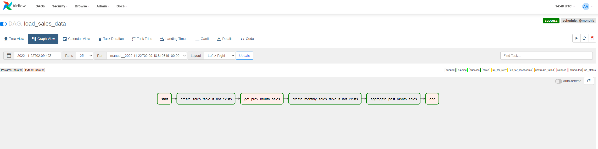

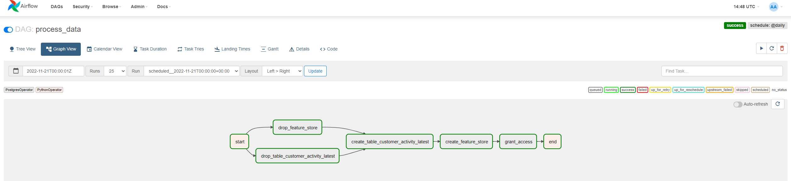

The process_data dag was responsible for creating new tables from customer and sales data.

Created as tables:
    - feature_store
    - customer_activity_latest
    - monthly sales
    
Therefore, the table structure of our database is:

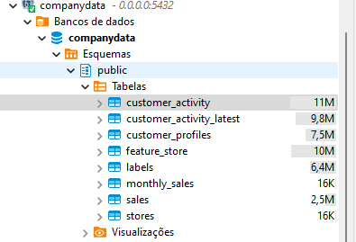

# EXTRA TASKS

## 1º Create new intermediate table

Create an intermediary table, called `customer_activity_ranked`, that adds an additional `activity_rank` column to the customer activity table. This column has, **for each customer**, value 1 for the latest activity, 2 for the second latest, 3 for the third latest, and so forth.

The following query was executed, available in sql/customer_activity_ranked.sql

create table customer_activity_ranked
as 
select idx,
       valid_from,
	   valid_to,
	   scd_a,
	   scd_b,
       RANK() OVER(PARTITION BY idx ORDER BY valid_from DESC) activity_rank
FROM customer_activity

Podemos visualizar os resultados na imagem abaixo

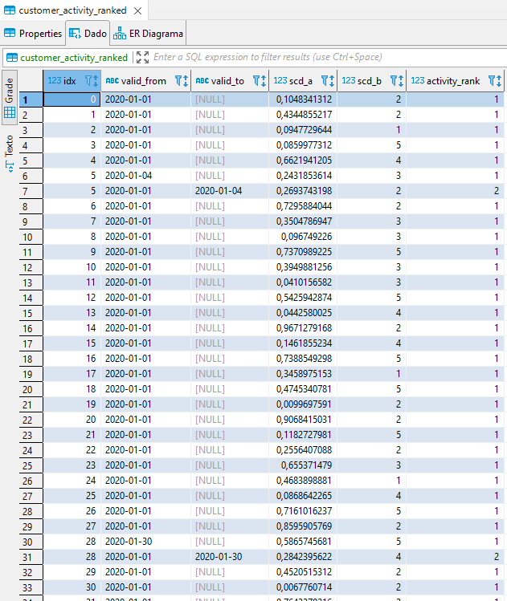

To better visualize the logic, we can see a filter of a customer.
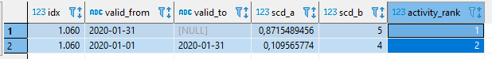

## 2º Configure Roles

A new user has been created for the database, user analytics. The code has been inserted into a setup_users.sql file so that it can be entered as access when creating the database for the first time.

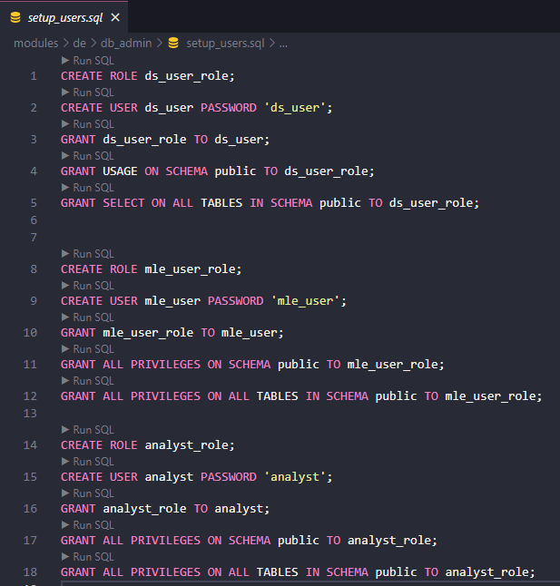

## 3º Statistics Rules

A statistic_result call was created so that an extra transformation is needed on the 3rd.

The query was built and can be accessed in the sql/statistic.question.sql file

select t1.store_idx,EXTRACT(YEAR FROM date) as "year", EXTRACT(MONTH FROM date) as "month", AVG(t1.value), COUNT(t1.value) of sales t1
left join t2 stores
in t1.idx = t2.idx
group by (t1.store_idx, "month", "year")
order by t1.store_idx, "year", "month"

It is important to take into account that the airflow was made to

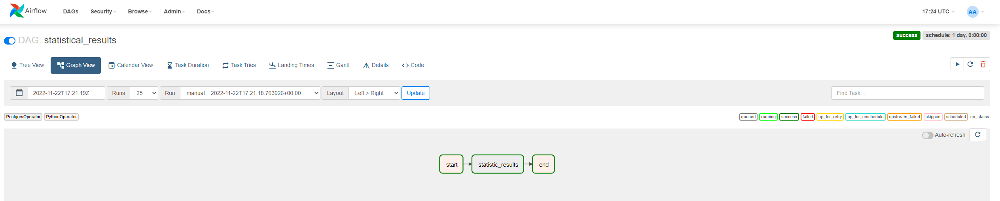

And the respective statistic task log.

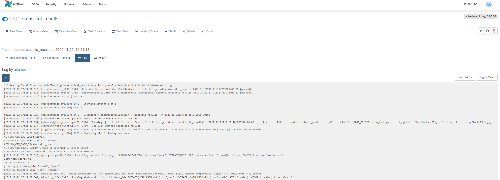

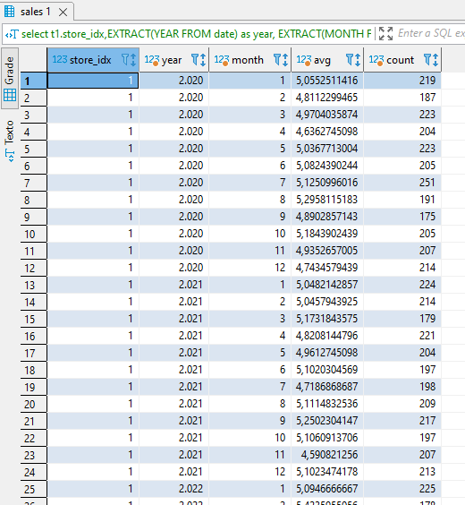

# DATA SCIENCE MODULE

This step contains the steps developed for the Data science solution.

Initially, this module depends on the data engineering module. It is necessary that the feature_store is ready. With the data saved in the database, we will develop a machine learning algorithm to classify the labels in the feature_store table.

Therefore, we need to connect to the database using the DS role and extract the table to work within a development environment.

**Toda solução pode ser encontrada no arquivo notbook.ipynb**

## LOADING DATA

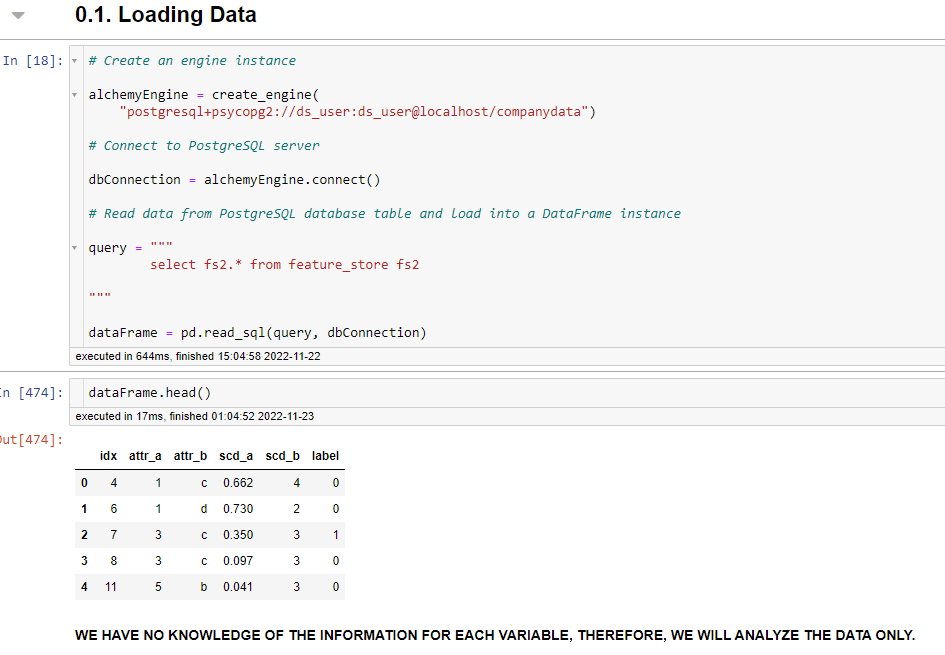

## DATA DESCRIPTION

Within the descriptive analysis, the following analyzes were carried out:

- Table size;
- Data type;
- Missing values;
- Descriptive statistics

We can see below an example of descriptive statistics of discrete data.

## EXPLORATORY DATA ANALYSIS

Exploratory Data Analysis (EDA) is the process of visualizing and analyzing data to extract insights from it. In other words, EDA is the process of summarizing important characteristics of data in order to gain better understanding of the dataset. Therefore, this part will be done in the following three steps:

- Univariate Analysis
- Bivariate Analysis
- Multivariate Analysis

Below we can see that the data to be predicted have an imbalance in the classes.

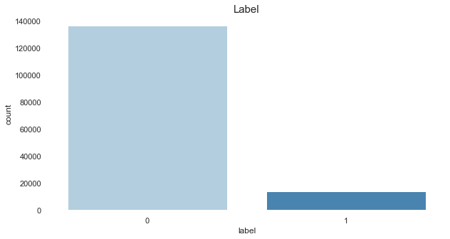

We can see an example of analysis that helped to understand the data

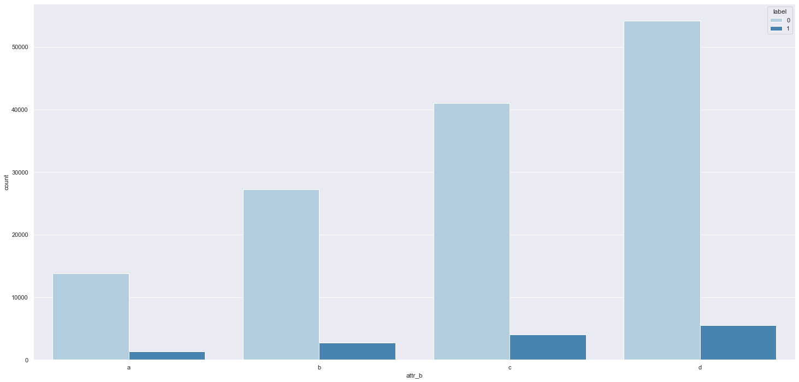

## DATA PREPARATION

At this stage, the following topics were developed:

- Encoding
     - Transforms categorical variable into number.
- Data balancing;
     - Data to be predicted is unbalanced. Training with unbalanced data can be a problem.
- Separation into training and testing;
     - Prevents data leakage and allows us to assess the quality of the model
- Rescaling;
     - Normalization of numerical data;

To build an accurate model we should always select features that are highly correlated and influence the price most. The above data exploration explains that few numeric features are highly correlated with price, I would be keeping these features for the model. On the other hand, we have seen how categorical features are influencing label.

## FEATURE SELECTION

So that we can identify the impact of variables on the response variable, we use a selector feature.

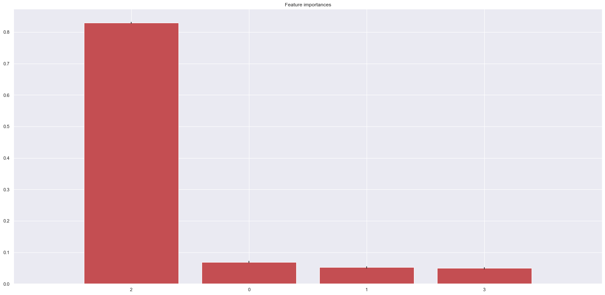

## MACHINE LEARNING MODELS

In this section, we will finally build our predictive models. Therefore, we will use 4 machine learning algorithms, which will be:

- Linear Regression
- Random Forest Regressor
- XGBoost
- LGBM

For each algorithm, we will build what we call the cross-validation technique. Cross-validation is primarily used in applied machine learning to estimate the skill of a machine learning model on unseen data. That is, to use a limited sample in order to estimate how the model is expected to perform in general when used to make predictions on data not used during the training of the model.

It is a popular method because it is simple to understand and because it generally results in a less biased or less optimistic estimate of the model skill than other methods, such as a simple train / test split.

For this, we will separate our predictor variables from our target variable and then separate them in training and testing.

We can see the final performance of the models

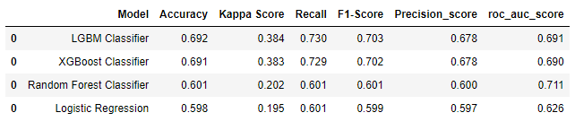

The metric we selected was the F1-Score. It is the harmonic mean between recall and precision. Therefore, we will continue with XGBoost.

Taking a closer look at XGBoost metrics

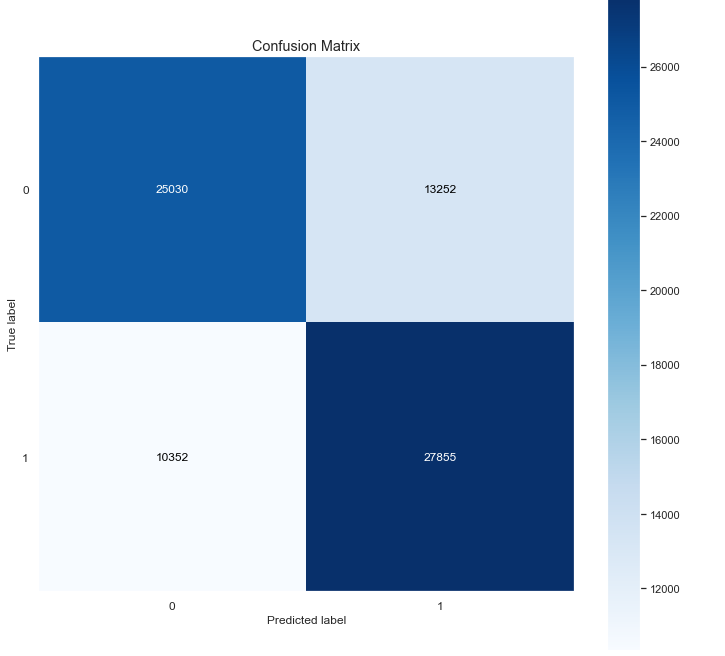
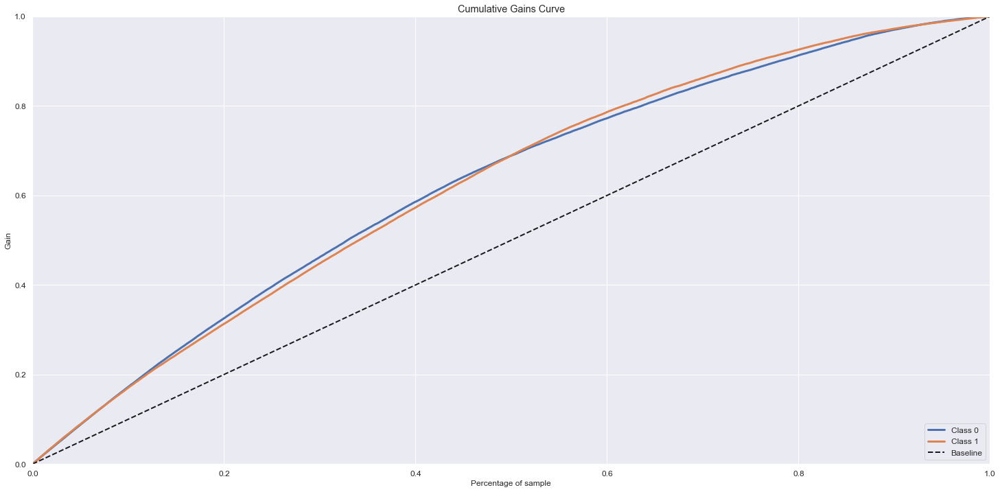
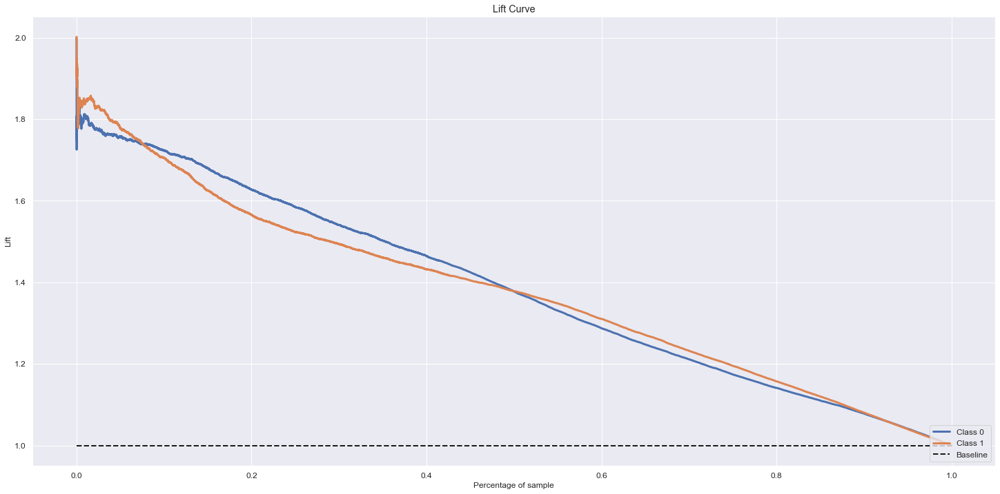

## DEPLOY MODEL

To build the model in production, a .pkl file was created with the trained model. We build the function:

- predict

This function allows performing the prediction automatically.

To build the API, Flask was used. The API is available in the main.py file.

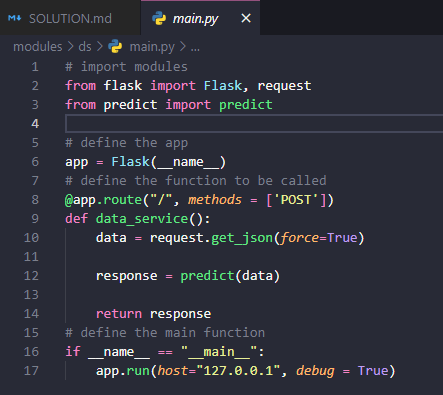

When running the API, we can verify that there is a connection:

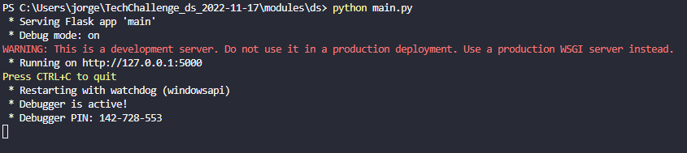

To perform the predictions, we use requests inside the jupyter notebook.

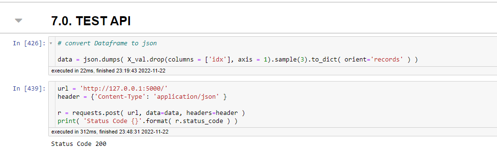

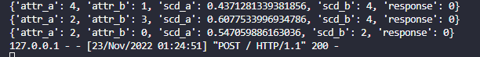

## DOCKER CONTAINER

Inside the DS folder you can find the following files

- Dockerfile
- requirements.txt

These files will be useful to build our docker container. After running the container, we can see it working locally.

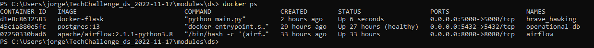

It is possible to see container with docker-flask image

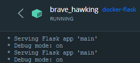

# MACHINE LEARNING ENGINEER

Functions were built inside the mle_model.py file containing all the necessary steps of the data science module. In addition, the logger function was created to view the records of each function as well as the error handling.
  

    

    

    