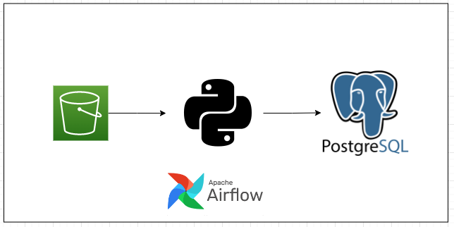
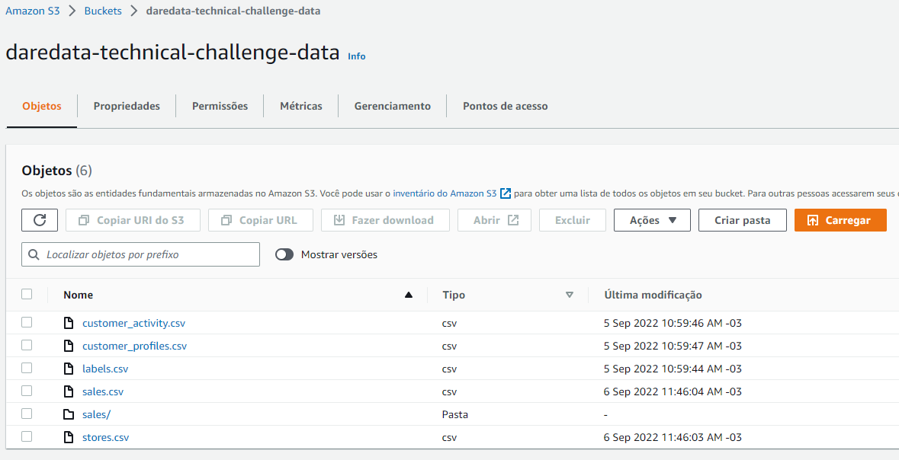
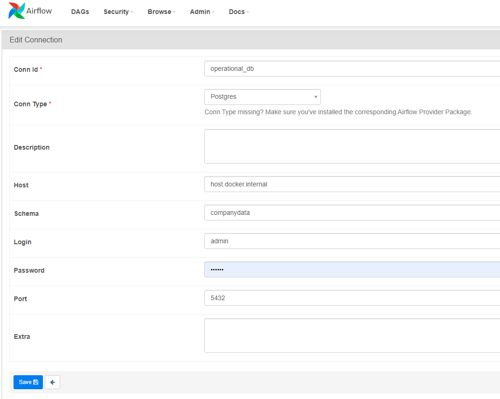

# DATA ENGINEERING MODULE

No starter module is where we go to the heart of the solution: data. Here we will perform the data operation, save to the database finish the ETL flow.

The solution was developed using 3 tools:
    - AWS S3;
    - Python;
    - Air flow;
    
The data were inserted into an S3 bucket, making it possible to carry out a transformation and load within a relational database.

Therefore, we will start the step of operating the data inside an S3 bucket.

## Infraestrutura

To be included again in the production environment, we created a docker container for airflow and for our relational postgres database.

Inside docker-compose.yaml it is possible to create containers for both.

For airflow, when did locally, we use the following information:

- URL: http://localhost:8080
- Default Login: airflow / airflow

- URL: http://localhost:8080
- Default login: airflow / airflow

To access the database we use:

- Host: operational-db
- Port: 5432
- Default login: admin / admin
- Database name: company data

From this information, we created two docker containers. We can see its execution in the image below:

## Define Roles para Users

As a form of data governance, Roles were created for each type of role. This will only allow access to the data that will be controlled for your role. inside the file
    - db_admin/setup_users.sql
It was defined as the following roles:
    - ds_user_role
    - mle_user_role

We can see in the image below the functions inside the database:

## Extract data from S3

The daredata-technical-challenge-data bucket was made available within S3 containing the following files:

to carry out the
The solution contains 3 dags, which are:
    - load_client_data: contains a data load related to a customer. This dag does a load of 4 tables.
    - load_sales_data: load of data related to sales, from 2020 to 2029.
    - process_data: create tables from previous loads.

Airflow itself has a very accessible graphical interface so that it has an interface. We can see it below:

As we use two containers within the services of the containers, it was necessary to create the connection between them and allow a greater variety of accesses. For this, we perform the following configuration:

{
    "operational_db": {
        "conn_type": "postgres",
        "login": "admin",
        "password": "admin",
        "host": "operating db",
        "port": 5432,
        "scheme": "company data"
  }
 }

Such configuration can also be done via the airflow UI, in the ADMIN -> Connections section.

So that we could use our Postgres database, we used the DBeaver tool. There put all the credentials and have a GUI as well.

With the connection properly created, database and tables created, we carry out the execution of the series.

To get the customer data, we run the load_client_data dag. We can write inside the flow below and dag see successful ways implemented within the database.

In the same way we run like two other dags.

The process_data dag was responsible for creating new tables from customer and sales data.

Created as tables:
    - feature_store
    - customer_activity_latest
    - monthly sales
    
Therefore, the table structure of our database is:

# EXTRA TASKS

## 1º Create new intermediate table

## 2º Configure Roles

A new user has been created for the database, user analytics. The code has been inserted into a setup_users.sql file so that it can be entered as access when creating the database for the first time.

## 3º Statistics Rules

A statistic_result call was created so that an extra transformation is needed on the 3rd.

The query was built and can be accessed in the sql/statistic.question.sql file

select t1.store_idx,EXTRACT(YEAR FROM date) as "year", EXTRACT(MONTH FROM date) as "month", AVG(t1.value), COUNT(t1.value) of sales t1
left join t2 stores
in t1.idx = t2.idx
group by (t1.store_idx, "month", "year")
order by t1.store_idx, "year", "month"

It is important to take into account that the airflow was made to

And the respective statistic task log.

  

    

    

    