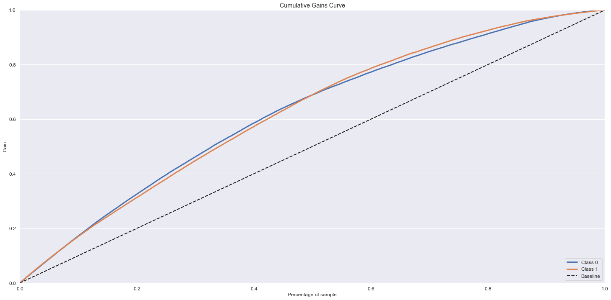

# DATA SCIENCE MODULE

This step contains the steps developed for the Data science solution.

Initially, this module depends on the data engineering module. It is necessary that the feature_store is ready. With the data saved in the database, we will develop a machine learning algorithm to classify the labels in the feature_store table.

Therefore, we need to connect to the database using the DS role and extract the table to work within a development environment.

**Toda solução pode ser encontrada no arquivo notbook.ipynb**

## LOADING DATA

## DATA DESCRIPTION

Within the descriptive analysis, the following analyzes were carried out:

- Table size;
- Data type;
- Missing values;
- Descriptive statistics

We can see below an example of descriptive statistics of discrete data.

## EXPLORATORY DATA ANALYSIS

Exploratory Data Analysis (EDA) is the process of visualizing and analyzing data to extract insights from it. In other words, EDA is the process of summarizing important characteristics of data in order to gain better understanding of the dataset. Therefore, this part will be done in the following three steps:

- Univariate Analysis
- Bivariate Analysis
- Multivariate Analysis

Below we can see that the data to be predicted have an imbalance in the classes.

We can see an example of analysis that helped to understand the data

## DATA PREPARATION

At this stage, the following topics were developed:

- Encoding
     - Transforms categorical variable into number.
- Data balancing;
     - Data to be predicted is unbalanced. Training with unbalanced data can be a problem.
- Separation into training and testing;
     - Prevents data leakage and allows us to assess the quality of the model
- Rescaling;
     - Normalization of numerical data;

To build an accurate model we should always select features that are highly correlated and influence the price most. The above data exploration explains that few numeric features are highly correlated with price, I would be keeping these features for the model. On the other hand, we have seen how categorical features are influencing label.

## FEATURE SELECTION

So that we can identify the impact of variables on the response variable, we use a selector feature.

## MACHINE LEARNING MODELS

In this section, we will finally build our predictive models. Therefore, we will use 4 machine learning algorithms, which will be:

- Linear Regression
- Random Forest Regressor
- XGBoost
- LGBM

For each algorithm, we will build what we call the cross-validation technique. Cross-validation is primarily used in applied machine learning to estimate the skill of a machine learning model on unseen data. That is, to use a limited sample in order to estimate how the model is expected to perform in general when used to make predictions on data not used during the training of the model.

It is a popular method because it is simple to understand and because it generally results in a less biased or less optimistic estimate of the model skill than other methods, such as a simple train / test split.

For this, we will separate our predictor variables from our target variable and then separate them in training and testing.

We can see the final performance of the models

The metric we selected was the F1-Score. It is the harmonic mean between recall and precision. Therefore, we will continue with XGBoost.

Taking a closer look at XGBoost metrics

## DEPLOY MODEL

To build the model in production, a .pkl file was created with the trained model. We build the function:

- predict

This function allows performing the prediction automatically.

To build the API, Flask was used. The API is available in the main.py file.

When running the API, we can verify that there is a connection:

To perform the predictions, we use requests inside the jupyter notebook.

## DOCKER CONTAINER

Inside the DS folder you can find the following files

- Dockerfile
- requirements.txt

These files will be useful to build our docker container. After running the container, we can see it working locally.

It is possible to see container with docker-flask image

